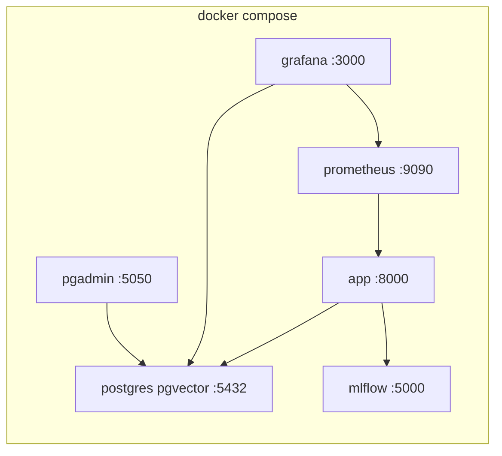
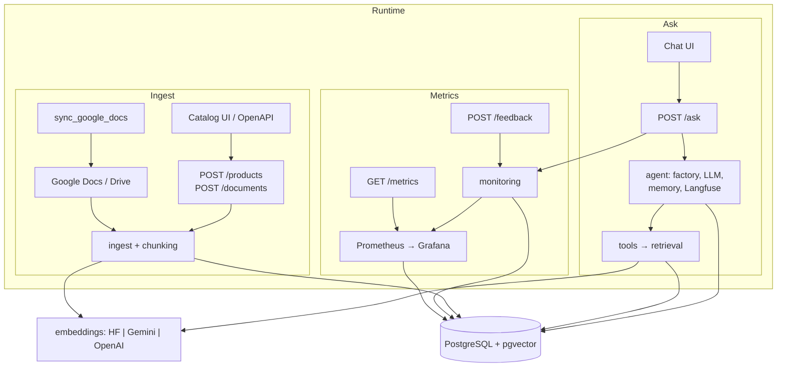
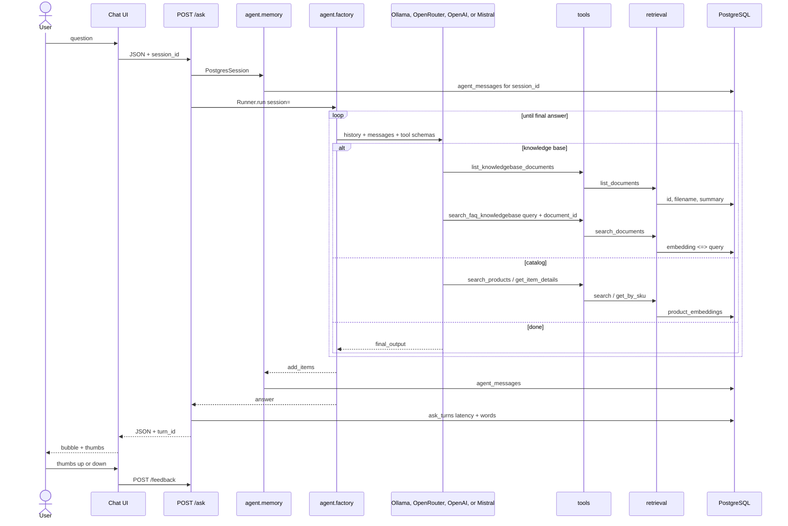
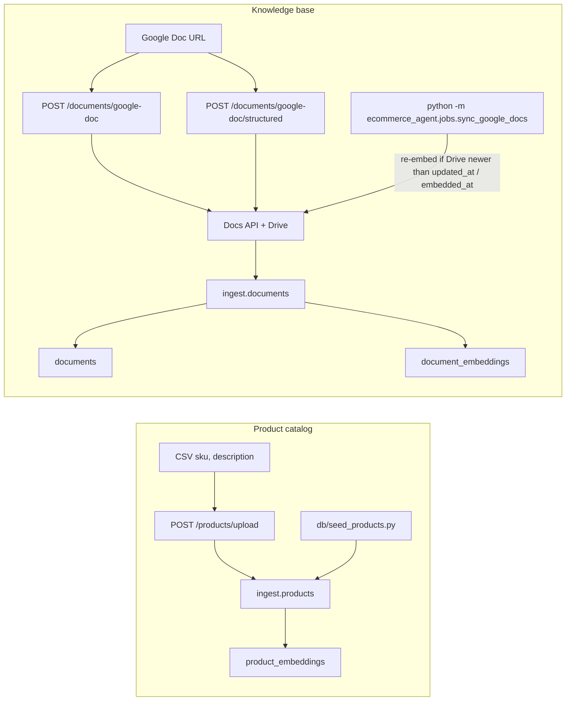
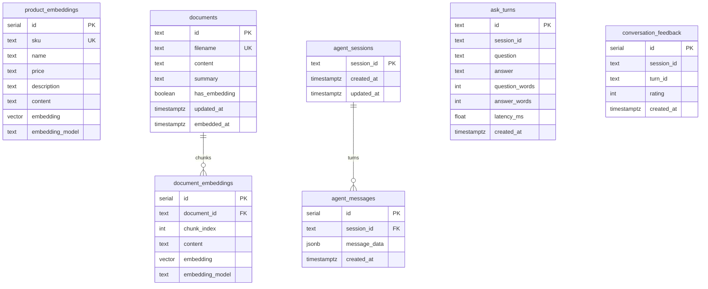

# Application architecture

As-built. Runtime Python is the `ecommerce_agent` package. Root shims (`app.py`, `agent.py`, `tools.py`, `vector_store.py`, `google_doc_reader.py`, `embeddings/`, `init/`) are gone.

```bash
make docker-up
```

Same as `docker compose up --build -d`. Host-only API: `make run_app` (`uv run uvicorn ecommerce_agent.api.app:app --reload`) with Postgres still in Compose.

## Layout

```text
ecommerce-agent/
├── ecommerce_agent/
│   ├── config.py                 # env: DB, LLM, embeddings, Google, tracing
│   ├── db.py                     # one SQLAlchemy engine
│   ├── api/
│   │   ├── app.py                # FastAPI factory
│   │   ├── schemas.py
│   │   └── routes/               # ask, feedback, products, documents, health, metrics
│   ├── agent/                    # llm, tracing (Langfuse), memory.py, instructions.md, instructions_v1.md, hooks, factory
│   ├── monitoring/               # Prometheus metrics + Postgres ask_turns / feedback
│   ├── tools/                    # catalog.py, knowledge.py
│   ├── retrieval/                # read-only products + documents
│   ├── ingest/                   # chunking, product/document writes, schema
│   ├── embeddings/               # lazy HF | Gemini | OpenAI
│   ├── integrations/google_docs.py
│   └── jobs/sync_google_docs.py
├── static/                       # chat + catalog HTML
├── db/                           # schema.md, init_vector_db.sql, seed, inspect.sql, pgadmin/servers.json, download_model
├── notebooks/
├── evals/                        # datasets, eval scripts, evaluation.md runbook
├── llm-api-tests/                # live chat/embedding API pings (not in uv run pytest)
├── grafana/                      # provisioned datasources + production dashboard
├── prometheus/                   # scrape app:8000/metrics
├── tests/
├── Dockerfile                    # app + evals + MLflow image (Python 3.12, uv)
├── docker-compose.yml            # postgres, app, mlflow, prometheus, grafana, pgadmin; optional ollama
├── .env.example                  # secrets template (copy to .env)
├── Makefile                      # make docker-up, docker-seed, docker-pgadmin, docker-inspect, docker-down, run_app, evals
├── AGENTS.md                     # TDD + keep README and architecture.md current
├── todo.md                       # scratch backlog
└── secrets/                      # gitignored service account
```

## Docker Compose

`docker-compose.yml` runs **postgres** (`pgvector/pgvector:pg16`), **app** (this Dockerfile, port 8000), **mlflow** (same image, port 5000, volume `mlflow-data`), **prometheus** (`prom/prometheus`, port 9090), **grafana** (`grafana/grafana`, port 3000, provisioned dashboards), and **pgadmin** (`dpage/pgadmin4`, port 5050). The app service sets `POSTGRES_HOST=postgres` and `MLFLOW_TRACKING_URI=http://mlflow:5000`. Google credentials are mounted from `./secrets`. The chat/catalog HTML is bind-mounted from `./static` and the Python package from `./ecommerce_agent` so UI and API changes apply without rebuilding the image. Profile `ollama` adds a local Ollama daemon. The image is Python 3.12; `pyproject.toml` sets `requires-python = ">=3.12,<3.14"` so uv does not try to resolve Torch for 3.14/Windows. App and MLflow start with `uv run --frozen --no-dev` so container start uses `uv.lock` and does not re-resolve. Schema is created by `make docker-seed` (`db/seed_products.py` → `init_db()`), not `db/init_vector_db.sql`. `init_db()` also ensures conversation tables `agent_sessions` and `agent_messages` and production tables `ask_turns` and `conversation_feedback` with `CREATE IF NOT EXISTS` when the catalog already exists. If `conversation_feedback.rating` is still text (`'up'` / `'down'`), monitoring drops that table and recreates it with integer `1` / `-1` (no `ALTER`). `make docker-pgadmin` is `docker compose up -d pgadmin` (no `--build`). `db/inspect.sql` lists tables and row counts (`make docker-inspect`).

Evals stay in **MLflow**. Production latency, word counts, and thumbs feedback are in **Grafana** (Prometheus scrape of `GET /metrics`, plus Postgres for recent feedback rows). **Langfuse** remains the cloud trace UI for tool calls and generations.



## System overview

Three paths share Postgres. Tool names, ingest endpoints, and sequence detail are in **Ask flow** and **Ingest and sync** below. `config.settings` is omitted here (see **Layer rules**).



## Layer rules

- **api** calls the agent factory or ingest. It does not run SQL or embedding math.
- **tools** call retrieval only. Tools never ingest.
- **retrieval** is SELECT + cosine search.
- **ingest** is the only writer of embeddings. Catalog `init_db()` still refuses to recreate product/document tables that already exist, but it always ensures conversation memory tables and production monitoring tables.
- **agent.memory** is the writer of chat turns (`agent_sessions`, `agent_messages`). Tables are `CREATE IF NOT EXISTS` so existing catalogs keep working.
- **monitoring** records production `ask_turns` (latency, word counts) and `conversation_feedback` (thumbs: `rating` 1 or -1), and exposes Prometheus series on `GET /metrics`. A leftover text-rating `conversation_feedback` table is dropped and recreated as integer.
- **jobs** reuse ingest + integrations. Not a second write path.
- **config.py** is the only module that reads environment variables.

## Ask flow

For FAQ / support, the agent lists document summaries first, then searches with that `document_id`. It must not invent contact details or policies. `search_faq_knowledgebase` requires `document_id` unless exactly one document exists.

The chat UI sends a `session_id` (browser `sessionStorage`). `POST /ask` passes `Runner.run(..., session=PostgresSession(session_id))` so prior turns are loaded from Postgres and new items are stored. Omit `session_id` for a single-turn call (evals do this). Each reply includes a `turn_id`; thumbs on the bubble `POST /feedback` with `rating` 1 (up) or -1 (down). Latency and word counts are recorded for Grafana.



## Ingest and sync

Google Doc **id** is `documents.id`. The Doc **title** is `filename`. Optional `summary` is what the LLM reads before searching.

`POST /documents/google-doc` and the sync job call `upsert_document`, which splits on `chunk_chars` (omit for OpenAI File Search default: 3200 chars, 50% overlap; FAQ pages 1200–1400; contracts ~3200).

`POST /documents/google-doc/structured` calls `upsert_documents_structured` with `summary_tag` / `question_tag` (`h1`, `h2`, …). Text under the first summary heading is stored on `documents.summary` unless the caller passes `summary`. Each question heading plus the text beneath it is one embedded chunk. `get_doc` turns Google Docs `HEADING_N` styles into ATX markdown (`#`, `##`) so those tags match.



The sync job skips ids that start with `file_`. It does not `ALTER` tables.

## Evals

Runbook: `evals/evaluation.md`. Scripts are not on the ask/ingest path.

`evals/datasets/faq_ground_truth.json` holds gold FAQ chunks. `evals/generate_eval_data.py` writes two synthetic shopper questions per FAQ to `evals/datasets/retrieval_eval_dataset.json` and `evals/datasets/llm_eval_dataset.json`.

`evals/evaluate_knowledge_search.py` scores `search_faq_knowledgebase` with hit@1, hit@k, MRR, and mean latency. `--search-type` is required (e.g. `genai_001_embedding`). `evals/evaluate_knowledge_search_mlflow.py` logs the same metrics plus params `search_type` and `embedding_model`; `--experiment` is required and reuses that MLflow experiment if it exists (otherwise creates it). Run names are `search-eval-{search_type}-{embedding_model}`. `make evaluate_retrieval SEARCH_TYPE=...` runs the terminal script. Local MLflow files (`mlruns/`, `mlartifacts/`, `mlflow.db`) are gitignored.

`evals/evaluate_llm_response.py` runs `build_agent()` (same tools and instructions as `POST /ask`) on those questions, one row at a time, then pauses 1 second after each prediction. `--provider` and `--experiment` are required; optional `--n` evaluates only the first n rows. The chat model is the provider default in `config.py`. After the agent is built, `provider` and `model` are read from it (`AgentLlmIdentity`) and logged as MLflow params, with mean `latency_ms` and token totals as metrics. Run names are `llm-eval-{provider}-{model}`. MLflow Correctness scores answers on the named experiment (created if missing). Default tracking URI is `http://127.0.0.1:5000` (`uv run mlflow server`); override with `MLFLOW_TRACKING_URI`. Needs ingested FAQ chunks in Postgres. `make evaluate_llms PROVIDER=... EXPERIMENT=...` runs this script (`N=...` passes `--n`). Experiment names: `ecommerce-agent-{kind}` (`llm_eval`, `search_eval`).

## LLM API smoke tests

`llm-api-tests/` pings each chat and embedding API with a one-token prompt. It is not on the ask/ingest path and is not collected by `uv run pytest`. `make llm_api_tests` runs the folder; a missing key (or unreachable Ollama) skips that test. Shared helpers live in `llm-api-tests/providers.py`.

## Data model and indexes

Column-level types and purpose: `db/schema.md`. The ER diagram below matches `init_db()` / memory / monitoring helpers.

New databases (`db/init_vector_db.sql` and `ingest.schema.init_db`) use **HNSW**. Existing databases that still have IVFFlat `lists = 100` keep working because retrieval sets `ivfflat.probes = 100` per query. No live `ALTER`. Conversation memory tables are additive (`CREATE TABLE IF NOT EXISTS`). `conversation_feedback` is dropped and recreated when `rating` is still text (`'up'` / `'down'`) so new rows store integer `1` / `-1`.

`embedding VECTOR(...)` width is fixed at `CREATE`. Python `init_db()` enables `CREATE EXTENSION IF NOT EXISTS vector`, then uses `provider.embedding_dim` (`hf` / bge-m3: 1024; `gemini`: 768; `openai` / text-embedding-3-small: 1536). `db/init_vector_db.sql` is hardcoded `VECTOR(1024)` for HF. Gemini's API returns 3072-d vectors; `GeminiEmbeddingProvider` requests `dimensions=768` and, if the API still returns 3072, truncates and L2-normalizes (Matryoshka). Switching providers after tables exist requires dropping `product_embeddings`, `document_embeddings`, and `documents`.



## Config

`ecommerce_agent.config.settings` reads **secrets** from `.env`. Chat/embedding backends are module constants in `config.py` and are not overridden by the environment. `build_model()` in `ecommerce_agent/agent/llm.py` uses `OpenAIChatCompletionsModel` for Mistral (Chat Completions at `MISTRAL_BASE_URL`) and `OpenAIResponsesModel` for OpenAI, OpenRouter, and Ollama.

| Variable / constant | Role |
|---|---|
| `POSTGRES_*` | Database URL (`.env`) |
| `LLM_PROVIDER` | `config.py` constant: `ollama`, `openrouter`, `openai`, or `mistral` (currently `mistral`) |
| `LOCAL_MODEL` | `config.py` constant derived from `LLM_PROVIDER == "ollama"` |
| `EMBEDDING_PROVIDER` | `config.py` constant: `hf` (1024-d), `gemini` (768-d), or `openai` (1536-d) (currently `gemini`) |
| `MODEL` | Optional `.env` chat-model override (`settings.model`). Defaults: Ollama `qwen2.5:7b`, OpenRouter `nvidia/nemotron-3.5-lightning:free`, OpenAI `gpt-4o-mini`, Mistral `mistral-small`. Fallbacks: `OLLAMA_MODEL` / `OPENROUTER_MODEL` / `OPENAI_MODEL` / `MISTRAL_MODEL` |
| `OPEN_ROUTER_API_KEY` / `OPENAI_API_KEY` / `MISTRAL_API_KEY` / `GEMINI_API_KEY` | Secrets in `.env`. Resolved into `settings.api_key` / `settings.embedding_api_key` |
| `LANGFUSE_PUBLIC_KEY` / `LANGFUSE_SECRET_KEY` | Secrets in `.env`. Tracing is on when `LANGFUSE_TRACING` is true in `config.py` and both keys are set (`settings.langfuse_enabled`). Agents SDK tracing stays enabled so OpenInference can export tool and generation spans under the `ask` observation |
| `LANGFUSE_BASE_URL` | Optional `.env` host (EU `https://cloud.langfuse.com`, US `https://us.cloud.langfuse.com`). Fallback constant `LANGFUSE_BASE_URL` in `config.py` |
| `LANGFUSE_ENVIRONMENT` | `config.py` constant (`development`) sent as `LANGFUSE_TRACING_ENVIRONMENT` |
| `EMBEDDING_MODEL` | Optional `.env` override (`settings.embedding_model`). Defaults in `DEFAULT_EMBEDDING_MODELS`: `BAAI/bge-m3`, `gemini-embedding-001`, `text-embedding-3-small`. Fallback: `OPENAI_EMBEDDING_MODEL`. Using another provider's default model, or constructing a backend that does not match `EMBEDDING_PROVIDER`, raises `ValueError` (`Provider model mismatch, please check your config.py file`) |
| `GOOGLE_SERVICE_ACCOUNT_FILE` | Defaults to `secrets/google_service_account.json` at the project root. Relative `creds_path` values passed to `get_doc` / `get_doc_text` are also resolved from the project root |
| `AGENT_TRACING` | `true` enables OpenAI Agents SDK platform traces (separate from Langfuse) |
| `MLFLOW_TRACKING_URI` | Optional. Used by evals that log to MLflow. Defaults to `http://127.0.0.1:5000`. Compose sets `http://mlflow:5000` on the `app` service |
| `GRAFANA_ADMIN_USER` / `GRAFANA_ADMIN_PASSWORD` | Grafana login (`.env`, default `admin` / `admin`). UI: `http://localhost:3000` |

Provider base URLs are module constants in `ecommerce_agent/config.py` (`OLLAMA_BASE_URL`, `OPENROUTER_BASE_URL`, `OPENAI_BASE_URL`, `MISTRAL_BASE_URL`, `GEMINI_OPENAI_BASE_URL`), each overridable by the same-named env var. They are not Settings fields.

The Hugging Face model loads on first `get_provider()` call, not at process import. `/health` does not embed.
