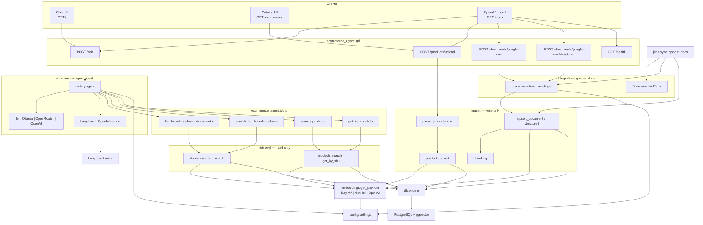
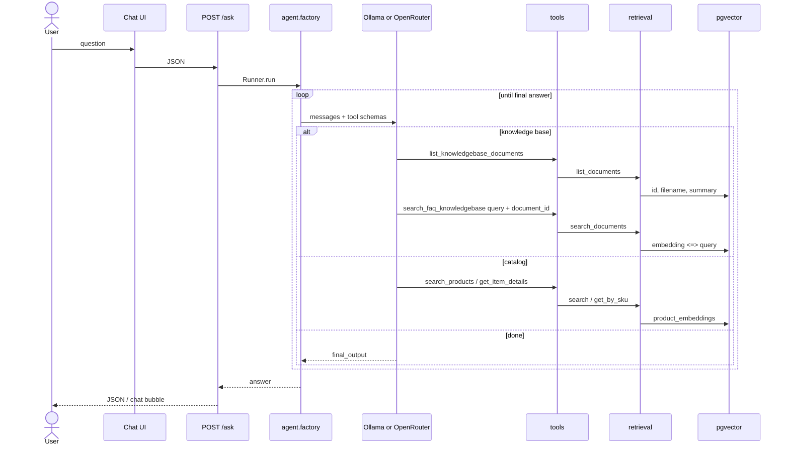
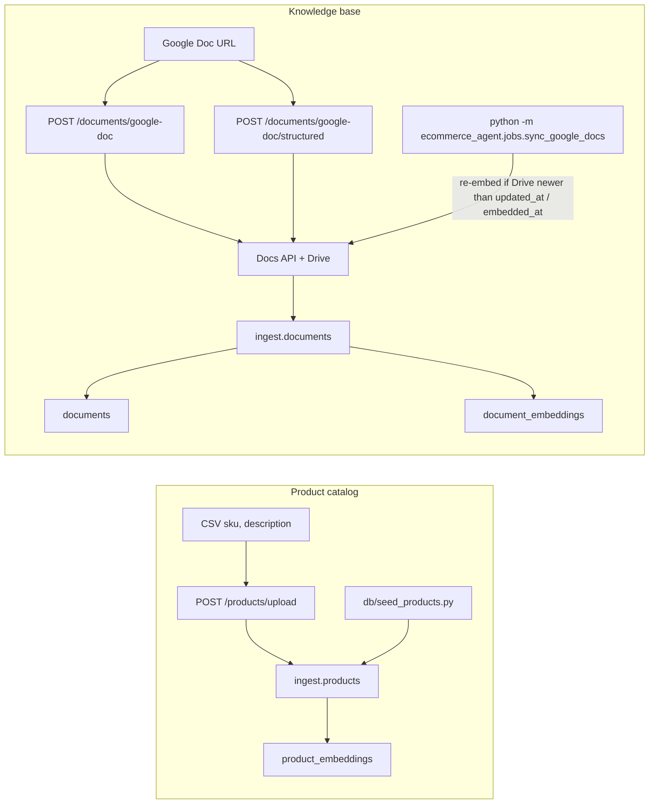
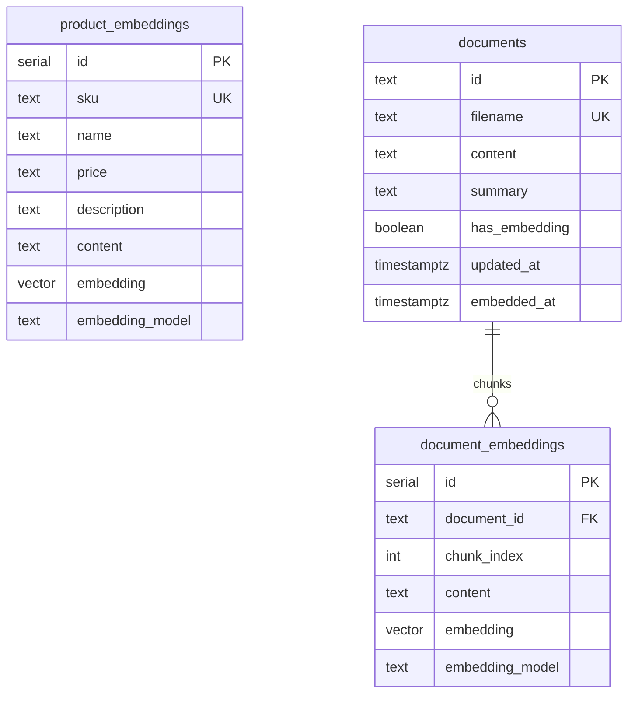

# Application architecture

As-built. Runtime Python is the `ecommerce_agent` package. Root shims (`app.py`, `agent.py`, `tools.py`, `vector_store.py`, `google_doc_reader.py`, `embeddings/`, `init/`) are gone.

```bash
make run_app
```

Same as `uv run uvicorn ecommerce_agent.api.app:app --reload`.

## Layout

```text
ecommerce-agent/
├── ecommerce_agent/
│   ├── config.py                 # env: DB, LLM, embeddings, Google, tracing
│   ├── db.py                     # one SQLAlchemy engine
│   ├── api/
│   │   ├── app.py                # FastAPI factory
│   │   ├── schemas.py
│   │   └── routes/               # ask, products, documents, health
│   ├── agent/                    # llm, tracing (Langfuse), instructions.md, hooks, factory
│   ├── tools/                    # catalog.py, knowledge.py
│   ├── retrieval/                # read-only products + documents
│   ├── ingest/                   # chunking, product/document writes, schema
│   ├── embeddings/               # lazy HF | Gemini | OpenAI
│   ├── integrations/google_docs.py
│   └── jobs/sync_google_docs.py
├── static/                       # chat + catalog HTML
├── db/                           # init_vector_db.sql, seed, download_model
├── notebooks/
├── evals/                        # FAQ ground truth + synthetic eval generator
├── tests/
├── Makefile                      # make run_app
├── AGENTS.md                     # TDD + keep README and architecture.md current
└── secrets/                      # gitignored service account
```

## System overview



## Layer rules

- **api** calls the agent factory or ingest. It does not run SQL or embedding math.
- **tools** call retrieval only. Tools never ingest.
- **retrieval** is SELECT + cosine search.
- **ingest** is the only writer of embeddings.
- **jobs** reuse ingest + integrations. Not a second write path.
- **config.py** is the only module that reads environment variables.

## Ask flow

For FAQ / support, the agent lists document summaries first, then searches with that `document_id`. It must not invent contact details or policies. `search_faq_knowledgebase` requires `document_id` unless exactly one document exists.



## Ingest and sync

Google Doc **id** is `documents.id`. The Doc **title** is `filename`. Optional `summary` is what the LLM reads before searching.

`POST /documents/google-doc` and the sync job call `upsert_document`, which splits on `chunk_chars` (omit for OpenAI File Search default: 3200 chars, 50% overlap; FAQ pages 1200–1400; contracts ~3200).

`POST /documents/google-doc/structured` calls `upsert_documents_structured` with `summary_tag` / `question_tag` (`h1`, `h2`, …). Text under the first summary heading is stored on `documents.summary` unless the caller passes `summary`. Each question heading plus the text beneath it is one embedded chunk. `get_doc` turns Google Docs `HEADING_N` styles into ATX markdown (`#`, `##`) so those tags match.



The sync job skips ids that start with `file_`. It does not `ALTER` tables.

## Evals

`evals/datasets/faq_ground_truth.json` holds gold FAQ question/answer pairs. `evals/generate_eval_data.py` calls the same LLM provider as the agent (Ollama, OpenRouter, or OpenAI), shows a tqdm bar per FAQ, and writes five `synthetic_question` rows per FAQ to `evals/datasets/faq_eval_synthetic.json`. It is not on the ask/ingest path.

## Data model and indexes

New databases (`db/init_vector_db.sql` and `ingest.schema.init_db`) use **HNSW**. Existing databases that still have IVFFlat `lists = 100` keep working because retrieval sets `ivfflat.probes = 100` per query. No live `ALTER`.

`embedding VECTOR(...)` width is fixed at `CREATE`. Python `init_db()` uses `provider.embedding_dim` (`hf` / bge-m3: 1024; `gemini`: 768; `openai` / text-embedding-3-small: 1536). `db/init_vector_db.sql` is hardcoded `VECTOR(1024)` for HF. Gemini's API returns 3072-d vectors; `GeminiEmbeddingProvider` requests `dimensions=768` and, if the API still returns 3072, truncates and L2-normalizes (Matryoshka). Switching providers after tables exist requires dropping `product_embeddings`, `document_embeddings`, and `documents`.



## Config

`ecommerce_agent.config.settings` reads **secrets** from `.env`. Chat/embedding backends are module constants in `config.py` and are not overridden by the environment.

| Variable / constant | Role |
|---|---|
| `POSTGRES_*` | Database URL (`.env`) |
| `LLM_PROVIDER` | `config.py` constant: `ollama`, `openrouter`, or `openai` (currently `openai`) |
| `LOCAL_MODEL` | `config.py` constant derived from `LLM_PROVIDER == "ollama"` |
| `EMBEDDING_PROVIDER` | `config.py` constant: `hf` (1024-d), `gemini` (768-d), or `openai` (1536-d) (currently `gemini`) |
| `MODEL` | Optional `.env` chat-model override (`settings.model`). Defaults: Ollama `qwen2.5:7b`, OpenRouter `nvidia/nemotron-3.5-lightning:free`, OpenAI `gpt-4o-mini`. Fallbacks: `OLLAMA_MODEL` / `OPENROUTER_MODEL` / `OPENAI_MODEL` |
| `OPEN_ROUTER_API_KEY` / `OPENAI_API_KEY` / `GEMINI_API_KEY` | Secrets in `.env`. Resolved into `settings.api_key` / `settings.embedding_api_key` |
| `LANGFUSE_PUBLIC_KEY` / `LANGFUSE_SECRET_KEY` | Secrets in `.env`. Tracing is on when `LANGFUSE_TRACING` is true in `config.py` and both keys are set (`settings.langfuse_enabled`). Agents SDK tracing stays enabled so OpenInference can export tool and generation spans under the `ask` observation |
| `LANGFUSE_BASE_URL` | Optional `.env` host (EU `https://cloud.langfuse.com`, US `https://us.cloud.langfuse.com`). Fallback constant `LANGFUSE_BASE_URL` in `config.py` |
| `LANGFUSE_ENVIRONMENT` | `config.py` constant (`development`) sent as `LANGFUSE_TRACING_ENVIRONMENT` |
| `EMBEDDING_MODEL` | Optional `.env` override (`settings.embedding_model`). Defaults in `DEFAULT_EMBEDDING_MODELS`: `BAAI/bge-m3`, `gemini-embedding-001`, `text-embedding-3-small`. Fallback: `OPENAI_EMBEDDING_MODEL`. Using another provider's default model, or constructing a backend that does not match `EMBEDDING_PROVIDER`, raises `ValueError` (`Provider model mismatch, please check your config.py file`) |
| `GOOGLE_SERVICE_ACCOUNT_FILE` | Defaults to `secrets/google_service_account.json` |
| `AGENT_TRACING` | `true` enables OpenAI Agents SDK platform traces (separate from Langfuse) |

Provider base URLs are module constants in `ecommerce_agent/config.py` (`OLLAMA_BASE_URL`, `OPENROUTER_BASE_URL`, `OPENAI_BASE_URL`, `GEMINI_OPENAI_BASE_URL`), each overridable by the same-named env var. They are not Settings fields.

The Hugging Face model loads on first `get_provider()` call, not at process import. `/health` does not embed.
