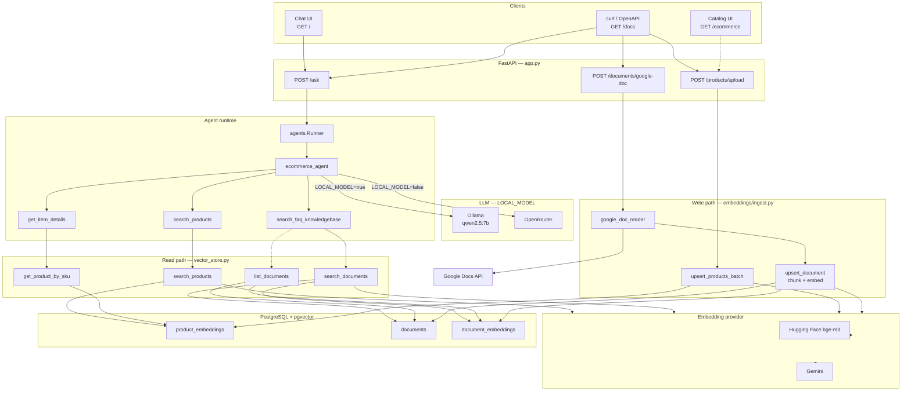
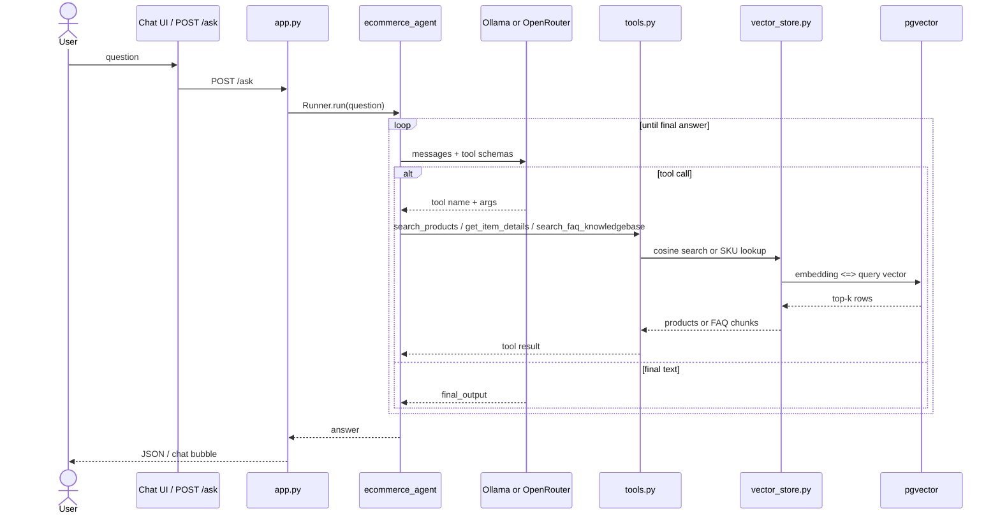
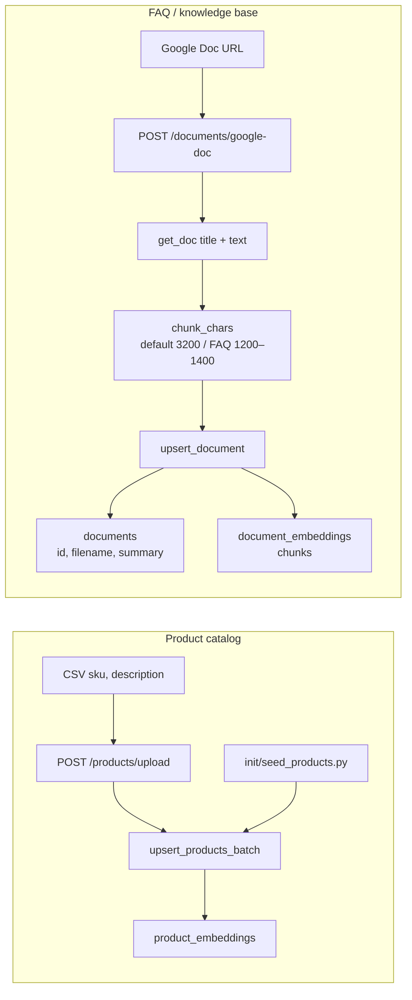
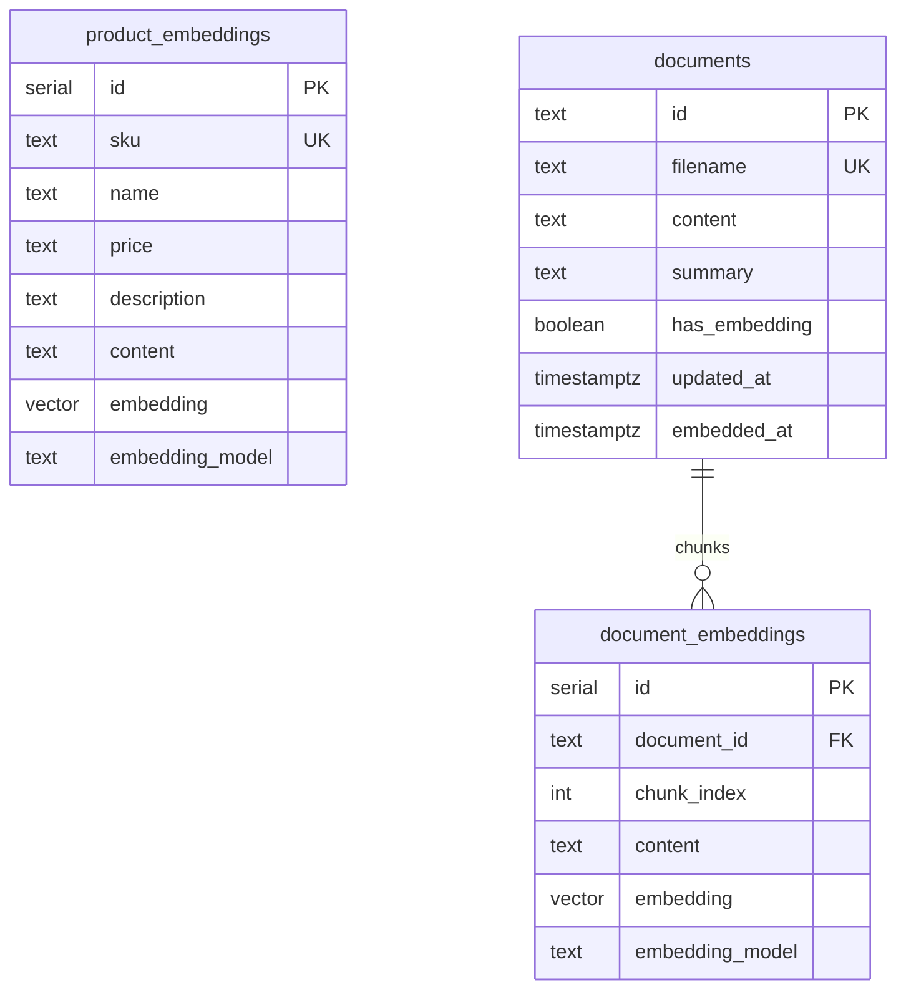

# Application architecture

## System overview

```mermaid
flowchart TB
    subgraph Clients
        ChatUI["Chat UI<br/>GET /"]
        CatalogUI["Catalog UI<br/>GET /ecommerce"]
        Curl["curl / OpenAPI<br/>GET /docs"]
    end

    subgraph FastAPI["FastAPI — app.py"]
        Ask["POST /ask"]
        Upload["POST /products/upload"]
        GDocEP["POST /documents/google-doc"]
    end

    subgraph AgentRuntime["Agent runtime"]
        Runner["agents.Runner"]
        Agent["ecommerce_agent"]
        TSearch["search_products"]
        TSku["get_item_details"]
        TFaq["search_faq_knowledgebase"]
    end

    subgraph LLM["LLM — LOCAL_MODEL"]
        Ollama["Ollama<br/>qwen2.5:7b"]
        OpenRouter["OpenRouter"]
    end

    subgraph WritePath["Write path — embeddings/ingest.py"]
        UpsertP["upsert_products_batch"]
        UpsertD["upsert_document<br/>chunk + embed"]
        Reader["google_doc_reader"]
    end

    subgraph ReadPath["Read path — vector_store.py"]
        SearchP["search_products"]
        GetSku["get_product_by_sku"]
        SearchD["search_documents"]
        ListD["list_documents"]
    end

    subgraph Embed["Embedding provider"]
        HF["Hugging Face bge-m3"]
        Gemini["Gemini"]
    end

    subgraph Store["PostgreSQL + pgvector"]
        Products["product_embeddings"]
        Docs["documents"]
        Chunks["document_embeddings"]
    end

    GDocs["Google Docs API"]

    ChatUI --> Ask
    Curl --> Ask
    Curl --> Upload
    Curl --> GDocEP
    CatalogUI -.-> Upload

    Ask --> Runner --> Agent
    Agent -->|"LOCAL_MODEL=true"| Ollama
    Agent -->|"LOCAL_MODEL=false"| OpenRouter
    Agent --> TSearch & TSku & TFaq

    TSearch --> SearchP
    TSku --> GetSku
    TFaq --> SearchD
    TFaq -.-> ListD

    Upload --> UpsertP
    GDocEP --> Reader --> GDocs
    Reader --> UpsertD

    SearchP & GetSku --> Products
    SearchD & ListD --> Docs & Chunks
    UpsertP --> Products
    UpsertD --> Docs & Chunks

    SearchP & SearchD & UpsertP & UpsertD --> Embed
    Embed --> HF
    Embed --> Gemini
```

## Ask flow

```mermaid
sequenceDiagram
    actor User
    participant UI as Chat UI / POST /ask
    participant App as app.py
    participant Agent as ecommerce_agent
    participant LLM as Ollama or OpenRouter
    participant Tools as tools.py
    participant VS as vector_store.py
    participant DB as pgvector

    User->>UI: question
    UI->>App: POST /ask
    App->>Agent: Runner.run(question)

    loop until final answer
        Agent->>LLM: messages + tool schemas
        alt tool call
            LLM-->>Agent: tool name + args
            Agent->>Tools: search_products / get_item_details / search_faq_knowledgebase
            Tools->>VS: cosine search or SKU lookup
            VS->>DB: embedding <=> query vector
            DB-->>VS: top-k rows
            VS-->>Tools: products or FAQ chunks
            Tools-->>Agent: tool result
        else final text
            LLM-->>Agent: final_output
        end
    end

    Agent-->>App: answer
    App-->>User: JSON / chat bubble
```

## Ingest flows

```mermaid
flowchart LR
    subgraph Products["Product catalog"]
        CSV["CSV sku, description"]
        Seed["init/seed_products.py"]
        UP["POST /products/upload"]
        Batch["upsert_products_batch"]
        PE["product_embeddings"]
    end

    subgraph Knowledge["FAQ / knowledge base"]
        URL["Google Doc URL"]
        GD["POST /documents/google-doc"]
        Fetch["get_doc title + text"]
        Chunk["chunk_chars<br/>default 3200 / FAQ 1200–1400"]
        UD["upsert_document"]
        DT["documents<br/>id, filename, summary"]
        DE["document_embeddings<br/>chunks"]
    end

    CSV --> UP --> Batch
    Seed --> Batch
    Batch --> PE

    URL --> GD --> Fetch --> Chunk --> UD
    UD --> DT
    UD --> DE
```

## Data model

```mermaid
erDiagram
    product_embeddings {
        serial id PK
        text sku UK
        text name
        text price
        text description
        text content
        vector embedding
        text embedding_model
    }

    documents {
        text id PK
        text filename UK
        text content
        text summary
        boolean has_embedding
        timestamptz updated_at
        timestamptz embedded_at
    }

    document_embeddings {
        serial id PK
        text document_id FK
        int chunk_index
        text content
        vector embedding
        text embedding_model
    }

    documents ||--o{ document_embeddings : chunks
```
