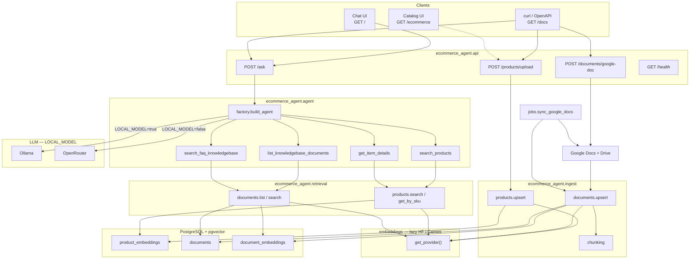
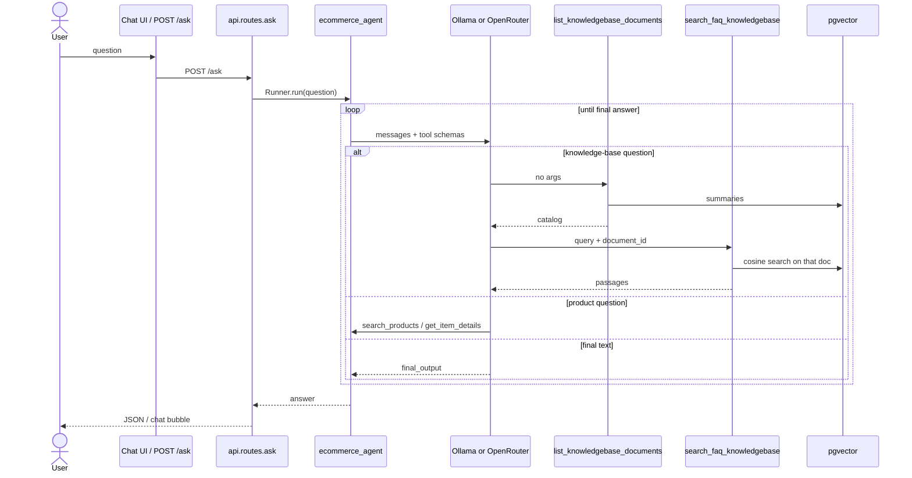
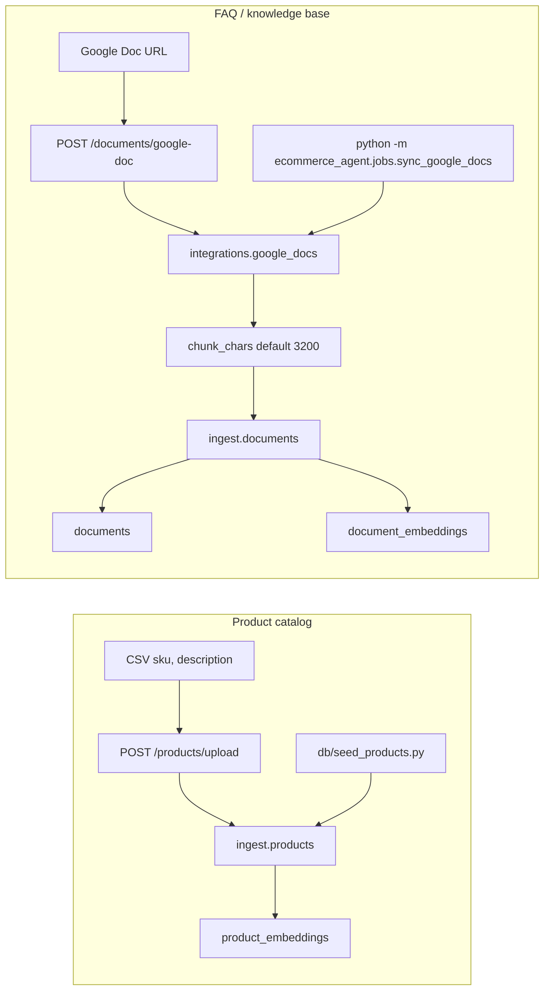
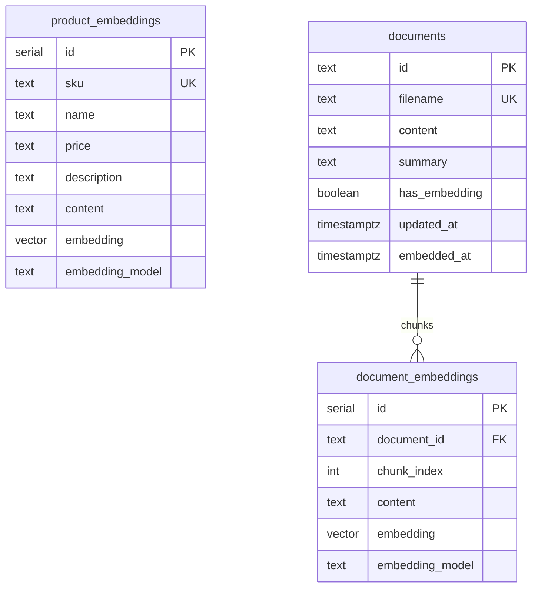

# Application architecture

As-built after the `architecture_proposal.md` package split.

## System overview

```mermaid
flowchart TB
    subgraph Clients
        ChatUI["Chat UI<br/>GET /"]
        CatalogUI["Catalog UI<br/>GET /ecommerce"]
        Curl["curl / OpenAPI<br/>GET /docs"]
    end

    subgraph FastAPI["ecommerce_agent.api"]
        Ask["POST /ask"]
        Upload["POST /products/upload"]
        GDocEP["POST /documents/google-doc"]
        Health["GET /health"]
    end

    subgraph AgentRuntime["ecommerce_agent.agent"]
        Factory["factory.build_agent"]
        TList["list_knowledgebase_documents"]
        TSearch["search_products"]
        TSku["get_item_details"]
        TFaq["search_faq_knowledgebase"]
    end

    subgraph LLM["LLM — LOCAL_MODEL"]
        Ollama["Ollama"]
        OpenRouter["OpenRouter"]
    end

    subgraph WritePath["ecommerce_agent.ingest"]
        UpsertP["products.upsert"]
        UpsertD["documents.upsert"]
        Chunk["chunking"]
    end

    subgraph ReadPath["ecommerce_agent.retrieval"]
        SearchP["products.search / get_by_sku"]
        SearchD["documents.list / search"]
    end

    subgraph Embed["embeddings — lazy HF | Gemini"]
        Provider["get_provider()"]
    end

    subgraph Store["PostgreSQL + pgvector"]
        Products["product_embeddings"]
        Docs["documents"]
        Chunks["document_embeddings"]
    end

    GDocs["Google Docs + Drive"]
    Job["jobs.sync_google_docs"]

    ChatUI --> Ask
    Curl --> Ask
    Curl --> Upload
    Curl --> GDocEP
    CatalogUI -.-> Upload

    Ask --> Factory
    Factory -->|"LOCAL_MODEL=true"| Ollama
    Factory -->|"LOCAL_MODEL=false"| OpenRouter
    Factory --> TList & TFaq & TSearch & TSku

    TSearch --> SearchP
    TSku --> SearchP
    TList --> SearchD
    TFaq --> SearchD

    Upload --> UpsertP
    GDocEP --> GDocs --> UpsertD
    UpsertD --> Chunk
    Job --> GDocs
    Job --> UpsertD

    SearchP --> Products
    SearchD --> Docs & Chunks
    UpsertP --> Products
    UpsertD --> Docs & Chunks

    SearchP & SearchD & UpsertP & UpsertD --> Provider
```

## Ask flow

```mermaid
sequenceDiagram
    actor User
    participant UI as Chat UI / POST /ask
    participant App as api.routes.ask
    participant Agent as ecommerce_agent
    participant LLM as Ollama or OpenRouter
    participant List as list_knowledgebase_documents
    participant Search as search_faq_knowledgebase
    participant DB as pgvector

    User->>UI: question
    UI->>App: POST /ask
    App->>Agent: Runner.run(question)

    loop until final answer
        Agent->>LLM: messages + tool schemas
        alt knowledge-base question
            LLM->>List: no args
            List->>DB: summaries
            List-->>LLM: catalog
            LLM->>Search: query + document_id
            Search->>DB: cosine search on that doc
            Search-->>LLM: passages
        else product question
            LLM->>Agent: search_products / get_item_details
        else final text
            LLM-->>Agent: final_output
        end
    end

    Agent-->>App: answer
    App-->>User: JSON / chat bubble
```

## Ingest flows

```mermaid
flowchart LR
    subgraph Products["Product catalog"]
        CSV["CSV sku, description"]
        Seed["db/seed_products.py"]
        UP["POST /products/upload"]
        Batch["ingest.products"]
        PE["product_embeddings"]
    end

    subgraph Knowledge["FAQ / knowledge base"]
        URL["Google Doc URL"]
        GD["POST /documents/google-doc"]
        Fetch["integrations.google_docs"]
        Chunk["chunk_chars default 3200"]
        UD["ingest.documents"]
        DT["documents"]
        DE["document_embeddings"]
        Cron["python -m ecommerce_agent.jobs.sync_google_docs"]
    end

    CSV --> UP --> Batch
    Seed --> Batch
    Batch --> PE

    URL --> GD --> Fetch --> Chunk --> UD
    Cron --> Fetch
    UD --> DT
    UD --> DE
```

## Data model

```mermaid
erDiagram
    product_embeddings {
        serial id PK
        text sku UK
        text name
        text price
        text description
        text content
        vector embedding
        text embedding_model
    }

    documents {
        text id PK
        text filename UK
        text content
        text summary
        boolean has_embedding
        timestamptz updated_at
        timestamptz embedded_at
    }

    document_embeddings {
        serial id PK
        text document_id FK
        int chunk_index
        text content
        vector embedding
        text embedding_model
    }

    documents ||--o{ document_embeddings : chunks
```
