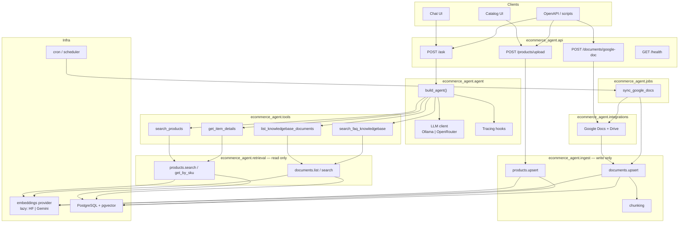
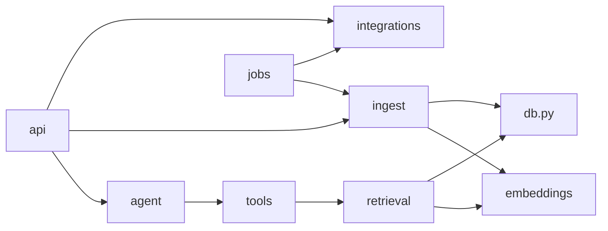
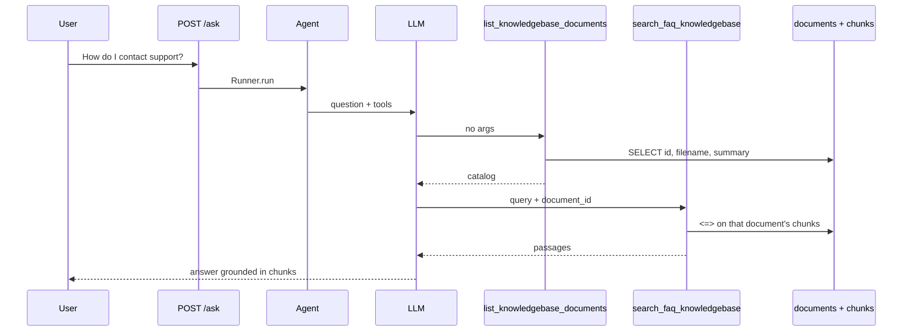

# Architecture proposal

Proposal only. This file does not describe the current tree; see `architecture.md` for that. Do not implement from this document until it is reviewed.

The current app already has the right seams: **read vs write**, **catalog vs knowledge base**, and **agent tools over SQL**. The problem is that those seams live as a handful of modules at the repo root, so HTTP, LLM wiring, Google Docs, chunking, and pgvector all collide in the same files.

This proposal packages the app around those seams, wires the missing knowledge-base catalog tool, and adds the two items already listed as pending: traces and a Google Doc freshness job.

## Goals

- One Python package with a clear import graph: API → agent/tools → retrieval or ingest → embeddings → DB.
- HTTP handlers stay thin. CSV parsing, Google Doc fetching, and embedding writes do not live in route modules.
- The agent always lists knowledge-base summaries before searching chunks, unless the user already named a document.
- Startup does not load the Hugging Face model until something actually embeds or searches.
- A daily job can re-embed a Google Doc when Drive says it changed, without `ALTER`ing existing tables.

## Target runtime



## Proposed file organization

Keep notebooks, static UI, SQL, and secrets outside the package. Move all runtime Python under `ecommerce_agent/`.

```text
ecommerce-agent/
├── ecommerce_agent/
│   ├── __init__.py
│   ├── config.py                 # env: DB, LLM, embeddings, Google creds
│   ├── db.py                     # engine + session factory (one connection story)
│   ├── api/
│   │   ├── __init__.py
│   │   ├── app.py                # FastAPI factory, CORS, lifespan
│   │   ├── schemas.py            # Question, GoogleDocIngest, …
│   │   └── routes/
│   │       ├── ask.py            # POST /ask
│   │       ├── products.py       # POST /products/upload
│   │       ├── documents.py      # POST /documents/google-doc
│   │       └── health.py
│   ├── agent/
│   │   ├── __init__.py
│   │   ├── llm.py                # Ollama vs OpenRouter client
│   │   ├── instructions.py       # system prompt, including tool-use order
│   │   ├── hooks.py              # print + tracing hooks
│   │   └── factory.py            # Agent(..., tools=[...])
│   ├── tools/
│   │   ├── __init__.py           # exports the @function_tool list
│   │   ├── catalog.py            # search_products, get_item_details
│   │   └── knowledge.py          # list_knowledgebase_documents, search_faq_knowledgebase
│   ├── retrieval/                # read path — never writes embeddings
│   │   ├── __init__.py
│   │   ├── products.py
│   │   └── documents.py
│   ├── ingest/                   # write path — never used by tools
│   │   ├── __init__.py
│   │   ├── chunking.py           # OpenAI default 3200; FAQ 1200–1400
│   │   ├── products.py
│   │   └── documents.py
│   ├── embeddings/               # unchanged providers, lazy singleton
│   │   ├── __init__.py           # get_provider() on first use
│   │   ├── base.py
│   │   ├── hf.py
│   │   └── gemini.py
│   ├── integrations/
│   │   ├── __init__.py
│   │   └── google_docs.py        # title + text; Drive modifiedTime
│   └── jobs/
│       ├── __init__.py
│       └── sync_google_docs.py   # compare Drive last_modified vs documents.updated_at
├── static/                       # chat + catalog HTML
├── db/
│   ├── init_vector_db.sql
│   └── seed_products.py
├── notebooks/
│   └── boiler.ipynb
├── data/                         # sample CSVs
├── secrets/                      # gitignored service account
├── architecture.md               # as-built
├── architecture_proposal.md      # this file
└── README.md
```

### Mapping from today

| Today | Proposed |
|---|---|
| `app.py` | `api/app.py` + `api/routes/*` + `api/schemas.py` |
| `agent.py` | `agent/llm.py` + `instructions.py` + `hooks.py` + `factory.py` |
| `tools.py` | `tools/catalog.py` + `tools/knowledge.py` |
| `vector_store.py` | `retrieval/products.py` + `retrieval/documents.py` |
| `embeddings/ingest.py` | `ingest/chunking.py` + `ingest/products.py` + `ingest/documents.py` |
| `google_doc_reader.py` | `integrations/google_docs.py` |
| `init/` | `db/` |
| `bolier.ipynb` | `notebooks/boiler.ipynb` |
| `main.py` (`Hello from…`) | drop; uvicorn points at `ecommerce_agent.api.app:app` |

`config.py` and `db.py` do not exist today. Both `vector_store.py` and `embeddings/ingest.py` currently build their own engine from env vars.

## Layer rules



- **api** may call ingest and the agent factory. It must not run SQL or embedding math.
- **tools** may call retrieval only. Tools never ingest.
- **retrieval** is SELECT + cosine search. No `INSERT`/`UPDATE`.
- **ingest** is the only writer of embeddings.
- **jobs** reuse ingest + integrations; they are not a second write path.

## Agent and tools

`list_knowledgebase_documents` already exists but is not attached to the agent. That is why `/ask` searches the FAQ with empty or `"none"` document ids and invents support emails.

Proposed tool set:

1. `list_knowledgebase_documents` — summaries only.
2. `search_faq_knowledgebase(query, document_id)` — `document_id` required after a list, unless there is exactly one document.
3. `search_products(query)`
4. `get_item_details(sku)`

Instructions should say: read summaries first; pass the matching `document_id`; do not answer policy/support from memory.



## Google Doc ingest and sync

Keep the current identity model: **Google Doc ID is `documents.id`**, title is `filename`, optional `summary` is what the LLM reads before searching.

`POST /documents/google-doc` stays the human ingest path (URL, optional summary, optional `chunk_chars`).

Add `jobs/sync_google_docs.py` for the README pending item:

1. Load rows from `documents` whose `id` looks like a Google Doc ID.
2. Call Drive `files.get` for `modifiedTime` (Docs API does not expose this cleanly).
3. If Drive is newer than `documents.updated_at` (or `embedded_at`), fetch text and call `ingest.documents.upsert` with the same id and stored `chunk_chars` if we persist it later; otherwise reuse the OpenAI default.
4. Leave tables alone if they already exist. No `ALTER`. If a new column is needed (`source`, `last_modified_at`, `chunk_chars`), it goes into a **new** `db/init_vector_db.sql` that the operator applies after dropping, same policy as today.

Run it with cron:

```bash
uv run python -m ecommerce_agent.jobs.sync_google_docs
```

## Config, embeddings, traces

`config.py` should be the only place that reads:

- `POSTGRES_*`
- `LOCAL_MODEL`, `OPEN_ROUTER_API_KEY`, model names
- `EMBEDDING_PROVIDER`
- `GOOGLE_SERVICE_ACCOUNT_FILE`

Embeddings: keep HF / Gemini, but **do not instantiate at import**. `get_provider()` on first `embed()` so `/health` and docs stay fast.

Tracing: enable Agents SDK tracing behind a flag (e.g. `AGENT_TRACING=true`) instead of unconditionally `set_tracing_disabled(True)`. `agent/hooks.py` can still print tool calls locally.

## Indexing (proposal, same tables)

IVFFlat with `lists = 100` returns **zero rows** on a one-chunk FAQ unless probes are raised. The current `SET LOCAL ivfflat.probes = 100` workaround belongs in retrieval, but the next schema rebuild should use **HNSW** (or skip an ANN index until there are hundreds of rows). That is a SQL change for a future init script, not an `ALTER` on the live DB.

## What not to change

- PostgreSQL + pgvector as the store.
- Separate product table vs document + chunk tables.
- Optional `chunk_chars` with OpenAI 3200 default and FAQ 1200–1400 guidance.
- CSV catalog upload and Google Doc ingest as the two write APIs.
- Static HTML UIs.

## Suggested rollout (when implementation starts)

1. Move files into `ecommerce_agent/` with re-exports so `uvicorn` and the notebook keep working.
2. Split `app.py` into routes; extract `config.py` / `db.py`.
3. Attach `list_knowledgebase_documents` and tighten instructions.
4. Lazy embedding provider + tracing flag.
5. Drive `modifiedTime` on the Google integration, then the sync job.

No application code was changed for this proposal.
